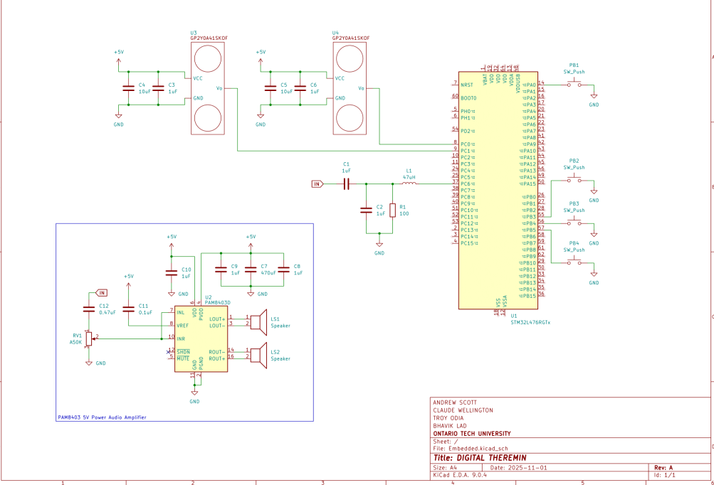

# DTHEREMIN

This project is an STM32 based digital musical theremin, that produces musical tones by translating human hand distance to sound pitch and volume. The project makes use of two Infared sensors to capture hand movement, which is then translated to musical sound, using a DSP algorithm in code.


_M1echanical design created by a collaborator_

## Features

- Real-time hand movement to musical sound producton.
- Direct Digital Synthesis algorithm implemented in C.
- Multiple musical output tones.
- Ability to increase/decrease output muscial octaves.

## Build

First clone the repo:

```
git clone https://github.com/troyodia/DTHEREMIN.git
```

The project makes use of the GNU Arm Embedded toolchain, specifically _gcc-arm-none-eabi_, to target the STM32L476RG microcontroller.

A Makefile is located at the root of the project to build the code. From the command-line the command below is used.

```
GCC_PATH=<INSERT GCC TOOL PATH> make
```

The path to the gcc-arm-none-eabi bin file must be inserted as the tool path.

So if the gcc bin tool path is located at _C:/gcc-arm-none-eabi/bin_:

```
GCC_PATH=C:/gcc-arm-none-eabi/bin make
```

## TESTS

The project has no unit tests but there are test functions located in Src/test/test.c. The file contains isolated tests for different peripherals and aspects of the code base. A test for ADC functionality is shown below.

```
GCC_PATH=C:/gcc-arm-none-eabi/bin TEST=test_adc make
```

## Asserts

Asserts when triggered trigger a breakpoint, then prints the assert address and then endlessly blinks an LED.
To locate the source of an Assert during \_addr2line is used with the current program counter to get the line number and file. A make rule for the functionality exists, the command is shown below for an assert triggered at address 0x8001350.

```
GCC_PATH=C:/gcc-arm-none-eabi/bin make addr2line ADDR=0x8001350
```

## Electrical Schematics


_Schematic drawing drafted by a collaborator based on my circuit design_
